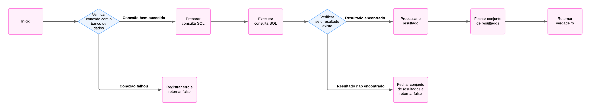

# Login Java com MySQL

Este repositório contém um exemplo de código Java para realizar login em um banco de dados MySQL.

## Problemas Encontrados e Soluções

### 1. **Erro nos Imports**
**Descrição**: As classes como `Connection`, `DriverManager`, e `Statement` não foram reconhecidas pela IDE.

**Causa**: O arquivo JAR do **MySQL Connector/J** não estava configurado corretamente no classpath.

**Solução**:
- Baixar o **MySQL Connector/J** do site oficial da Oracle.
- Adicionar o arquivo JAR ao classpath do projeto na IDE (Eclipse/IntelliJ).
- Atualizar os imports para incluir as classes `java.sql`.

### 2. **Erro de Conexão ao Banco**
**Descrição**: O código apresentou falha ao tentar conectar ao banco de dados.

**Causa**: Problemas na string de conexão (`JDBC URL`).

**Solução**:
- Certificar-se de que o banco está rodando localmente na porta correta.
- Ajustar a string de conexão para:
  ```java
  String url = "jdbc:mysql://127.0.0.1:3306/test?user=lopes&password=123";

# Plano de Teste

## Grafo de Fluxo

O grafo de fluxo do código foi criado com base nos pontos de execução do método `verificarUsuario` da classe `User`. Os pontos foram numerados e interligados conforme os fluxos possíveis de execução.



## Complexidade Ciclomática

A complexidade ciclomática do código foi calculada com base na seguinte fórmula:

\[M = E - N + 2P\]

Onde:
- **E** = número de arestas (fluxos de controle)
- **N** = número de nós (pontos de decisão ou blocos de código)
- **P** = número de componentes conexos (normalmente 1)

### Cálculo:
- **E = 6** (Existem 6 fluxos de controle no grafo de fluxo)
- **N = 5** (Existem 5 pontos de decisão no código)
- **P = 1** (O código possui um único componente conexo)

A complexidade ciclomática é:
\[M = 6 - 5 + 2(1) = 3\]

Portanto, a complexidade ciclomática do código é **3**, indicando que existem **3 caminhos independentes** no fluxo do programa.


  
